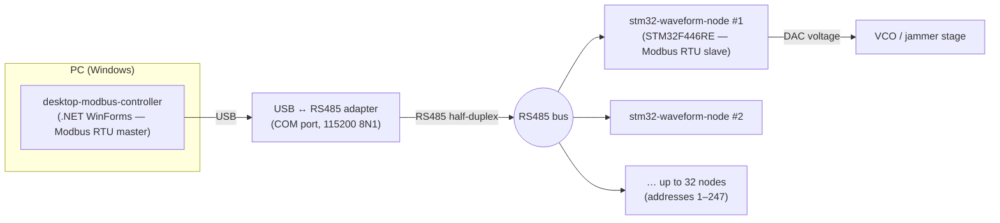

# Jammer — Technical Documentation

This folder contains the full technical specifications for the two software
components of the **Jammer** system: an embedded + desktop platform for
configuring and controlling voltage-controlled frequency-sweep ("VCO jammer")
nodes over an RS485 Modbus RTU bus.

## System at a glance

## Documents

| Document | Component | Contents |
|----------|-----------|----------|
| [desktop-modbus-controller-spec.md](desktop-modbus-controller-spec.md) | .NET WinForms desktop app | Master-side architecture, Modbus RTU client, UI, CSV import/export |
| [stm32-waveform-node-spec.md](stm32-waveform-node-spec.md) | STM32F446RE firmware | Slave-side architecture, waveform generation, EEPROM persistence, peripherals |
| [modbus-protocol-spec.md](modbus-protocol-spec.md) | Shared contract | Register map, function codes, frame formats, CRC, status flags |

> The register map is the **shared contract** between the two components — both
> must agree on addresses, units and encodings. See
> [modbus-protocol-spec.md](modbus-protocol-spec.md).
