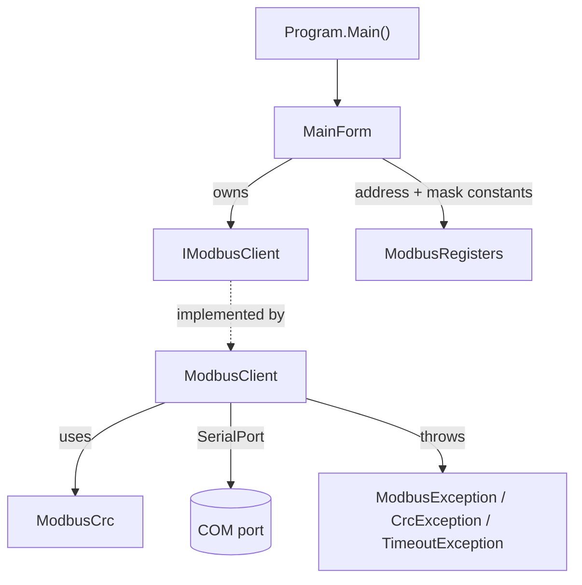

# Desktop Modbus Controller — Technical Specification

## 1. Overview

`desktop-modbus-controller` is a Windows desktop application that acts as the
**Modbus RTU master** for the Jammer system. It connects to an RS485 bus through
a USB-to-RS485 adapter (or the STM32 ST-Link virtual COM port in debug mode) and
lets an operator read, edit, and write the holding registers of a
[waveform node](stm32-waveform-node-spec.md), change a node's Modbus address,
and save/load register sets as CSV files.

## 2. Technology stack

| Aspect | Value |
|--------|-------|
| Framework | .NET Framework 4.7.2 |
| UI toolkit | Windows Forms (WinForms) |
| Language | C# 7.x |
| Output type | `WinExe` (`DesktopModbusController.exe`) |
| Root namespace | `DesktopModbusController` |
| Third-party deps | None — Modbus RTU implemented from scratch |
| Serial I/O | `System.IO.Ports.SerialPort` (BCL) |
| Build | MSBuild / Visual Studio 2019/2022; `Jammer.sln` |

### 2.1 Assembly references

`System`, `System.Core`, `System.Data`, `System.Drawing`,
`System.IO.Ports`, `System.Windows.Forms`, `System.Xml`.

## 3. Project structure

```
desktop-modbus-controller/
├── Program.cs                    ← WinForms entry point
├── Forms/
│   └── MainForm.cs               ← single-window UI + all interaction logic
├── Modbus/
│   ├── IModbusClient.cs          ← master abstraction (real vs. demo)
│   ├── ModbusClient.cs           ← RTU master over SerialPort
│   ├── ModbusCrc.cs              ← CRC16 lookup-table calculator
│   ├── ModbusRegisters.cs        ← register address + status-mask constants
│   └── ModbusException.cs        ← exception hierarchy
└── desktop-modbus-controller.csproj
```

> The context notes describe additional `Devices/`, `Services/` and
> `DeviceConfigForm` classes; the **current** codebase implements a single
> `MainForm` that performs all operations directly. This spec documents the code
> as it exists.

## 4. Architecture



### 4.1 Component responsibilities

| Type | Responsibility |
|------|----------------|
| `Program` | STA entry point; enables visual styles and runs `MainForm`. |
| `MainForm` | Builds the UI programmatically; handles connect/disconnect, read/write, device-ID change, and CSV import/export. |
| `IModbusClient` | Transport-agnostic master interface (`Connect`, `Disconnect`, `IsConnected`, FC03/04/06/16). Enables a future demo/simulated client. |
| `ModbusClient` | Concrete master: builds RTU frames, sends over `SerialPort`, reads and validates responses. Thread-safe via internal lock. |
| `ModbusCrc` | Static CRC16 calculator (poly `0xA001`), lazily built 256-entry table. |
| `ModbusRegisters` | Register addresses and status bit masks — the desktop copy of the shared contract. |
| `ModbusException` family | `ModbusException` (with device exception code), `ModbusCrcException`, `ModbusTimeoutException`. |

## 5. Modbus client (`ModbusClient`)

### 5.1 Construction & connection

- Constructed with a COM port name and baud rate; opens a `SerialPort`
  configured **8 data bits, no parity, 1 stop bit**.
- Read/write timeouts: **2000 ms** (`ReadTimeoutMs`).
- `Connect()` / `Disconnect()` open/close the port; `IsConnected` reports state.
  All are guarded by an internal `_lock` so the client is safe to call from the
  UI thread and a background `Task`.

### 5.2 Supported operations

| Method | FC | Notes |
|--------|----|-------|
| `ReadHoldingRegisters(addr, start, count)` | 0x03 | Returns `ushort[count]`. |
| `ReadInputRegisters(addr, start, count)` | 0x04 | Returns `ushort[count]`. |
| `WriteSingleRegister(addr, reg, value)` | 0x06 | Validates the echoed response. |
| `WriteMultipleRegisters(addr, start, values)` | 0x10 | Rejects empty `values`. |

### 5.3 Frame building & validation

- Requests are assembled byte-by-byte; the CRC is appended low-byte-first via
  `AppendCrc`.
- `SendFrame` discards the input buffer before writing to avoid stale bytes.
- `ReadResponse` reads the 2-byte header first, then either 5 bytes (exception)
  or the full expected length — so a short exception frame is not awaited as if
  it were a full response.
- `ReadExact` loops on `SerialPort.Read` against a wall-clock deadline,
  tolerating per-read `TimeoutException`s until the overall deadline, then
  throwing `ModbusTimeoutException`.
- CRC is verified on every response; mismatches throw `ModbusCrcException`.
- Exception frames throw `ModbusException` carrying the device exception code
  (`0x01`–`0x04`), after first validating the exception frame's own CRC so line
  noise is reported as a CRC fault rather than a spurious device exception.

### 5.4 Error model

| Exception | Raised when |
|-----------|-------------|
| `ModbusTimeoutException` | No / incomplete response within 2000 ms. |
| `ModbusCrcException` | Response CRC mismatch. |
| `ModbusException` | Device returned a Modbus exception frame; `ExceptionCode` holds the code. |

## 6. User interface (`MainForm`)

The UI is a single resizable window built entirely in code (no `.Designer.cs`).

### 6.1 Layout

```
┌─────────────────────────────────────────────┐
│ COM Port: [COMx ▼] [↻]                        │
│ Speed:    [115200 ▼]        Address: [ 1 ]    │
│ New Device ID: [ 1 ]  [ Set ID ]              │
│ ┌── register panel (scrollable) ───────────┐ │
│ │ 0x0000  Min Frequency (MHz)      [    0 ] │ │
│ │ 0x0001  Max Frequency (MHz)      [    0 ] │ │
│ │ 0x0002  Output Enable (0/1)      [    0 ] │ │
│ │ 0x0003  Sweep Rate (kHz)         [    0 ] │ │
│ │ 0x0004  Cal 1 Freq (MHz)         [    0 ] │ │
│ │ …  (through Cal 10 Voltage, 0x0017)       │ │
│ └───────────────────────────────────────────┘ │
│ [Connect][Disconnect][Read All][Write All]    │
│ [Save Device Settings][Open Device Settings]  │
│ ┌── status text ───────────────────────────┐ │
│ └───────────────────────────────────────────┘ │
└─────────────────────────────────────────────┘
```

- **26 register boxes** cover the 24 contiguous registers `0x0000`–`0x0017`,
  Sweep Pause at `0x0019`, and Triangle Mode at `0x001A`.
- **Baud rates** offered: 9600, 19200, 38400, 57600, 115200 (default 115200).
- **Address** selector: 1–247. **New Device ID**: 1–247.
- **Sweep Pause**: register-list entry at `0x0019`, 0–10,000 µs.
- **Triangle Mode**: register-list entry at `0x001A`, 0 = sawtooth, 1 = triangle.

### 6.2 Actions

| Control | Behaviour |
|---------|-----------|
| `↻` Refresh | Re-enumerates COM ports via `SerialPort.GetPortNames()`. |
| Connect | Creates a `ModbusClient` for the selected port/baud and opens it. |
| Disconnect | Closes and disposes the client. |
| Read All | FC03 reads holding registers `0x0000`–`0x0017` into the boxes and reads `0x0019` and `0x001A` individually. |
| Write All | FC16 bulk-writes registers `0x0000`–`0x0017`, then FC06 writes `0x0019` and `0x001A` individually. |
| Set ID | FC06 write to `0x0018` on a background `Task`; updates the target address on success. |
| Save Device Settings | Writes current register-list values to CSV (excludes Output Enable). |
| Open Device Settings | Loads CSV values into register-list entries (matched by address); does not write to device. |

### 6.3 Concurrency & state

- A `_busy` flag plus `SetBusy()` disable action buttons during the async
  "Set ID" transaction and set a wait cursor, preventing re-entrancy.
- `UpdateControlStates()` enables/disables controls based on connection and busy
  state (e.g. port/baud/refresh are locked while connected).
- On close, `OnFormClosing` disposes the client.

### 6.4 Set Device ID flow

`Set ID` writes the persisted device-address register (`0x0018`). The slave
stores the new address to EEPROM and answers the request from its **current**
address, so `MainForm` updates its target address selector to the new value for
subsequent transactions. A no-op message is shown if new == current.

### 6.5 Feedback

- `SetStatus(message, isError)` updates the read-only status box (gray = info,
  firebrick = error).
- `ShowError` also raises a modal `MessageBox` so failures are unmissable.

## 7. CSV import / export

The Save/Open buttons persist register values to disk independent of any device
connection.

### 7.1 Format

```
Address,Name,Value
0x0000,Min Frequency (MHz),1
0x0001,Max Frequency (MHz),1000
0x0003,Sweep Rate (kHz),100
0x0004,Cal 1 Freq (MHz),1
...
```

- Header row `Address,Name,Value`.
- **Output Enable (`0x0002`) is deliberately excluded** on save — it is volatile
  runtime state, not a stored setting.
- The **value is taken from the last field**, so commas inside the name column
  are harmless.
- Addresses parse in hex (`0x0004`) or decimal form (`TryParseAddress`).

### 7.2 Load semantics

- Rows are matched to register boxes by address; unknown or unparseable rows are
  skipped.
- Loading only populates the UI boxes — the operator must press **Write All** to
  send the values to the device.

## 8. Security & robustness notes

- No network exposure; local serial I/O only.
- All device input is length-checked and CRC-validated before use; malformed or
  noisy frames raise typed exceptions rather than corrupting state.
- User-entered register values are validated as `ushort` (0–65535) before write.
- File I/O uses standard dialogs; CSV parsing tolerates malformed rows without
  throwing.

## 9. Build & run

1. Open `desktop-modbus-controller/Jammer.sln` in Visual Studio 2019/2022.
2. Restore/confirm .NET Framework 4.7.2 targeting pack is installed.
3. Build → run `DesktopModbusController.exe`.
4. Select the COM port for the USB-RS485 adapter (or the STM32 VCP port), set
   baud 115200, choose the device address, then **Connect**.
